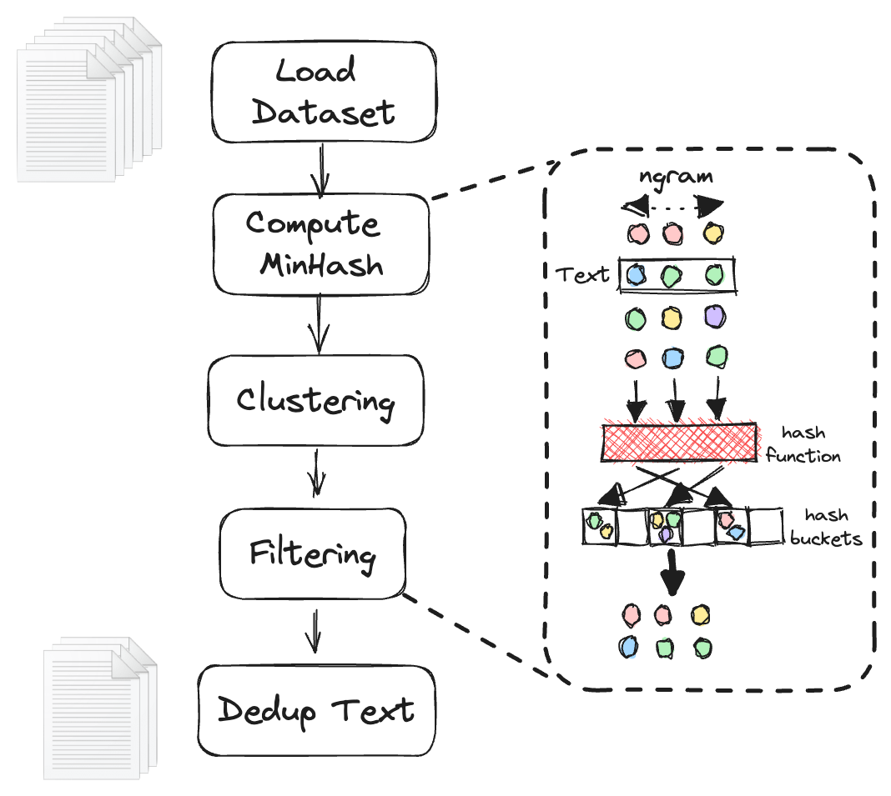
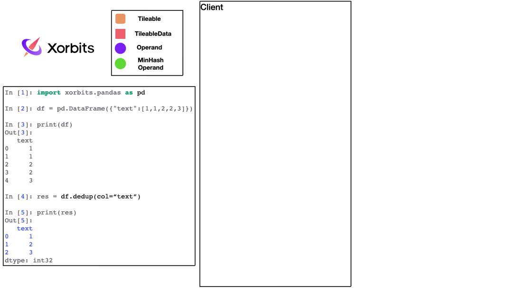
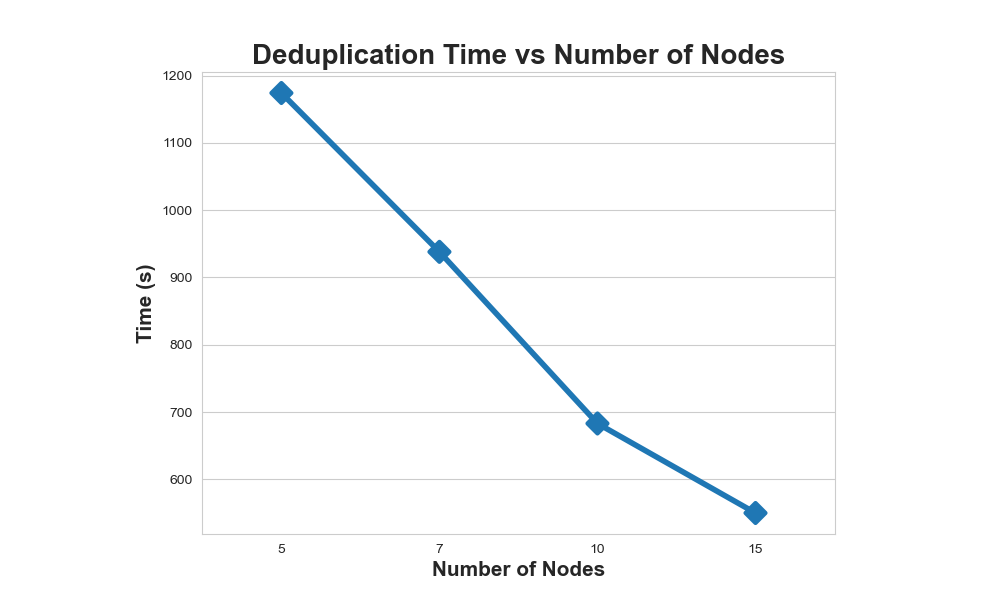

[Original source](https://xorbits.io/blogs/text-deduplicate)

## Introduction

In the realm of Large Language Models (LLMs), text deduplication is integral. It enhances training efficiency while mitigating privacy issues<sup><a href="#privacy">1</a><a href="#eff">2</a></sup>. LLMs rely heavily on extensive, diverse datasets, many of which are rife with duplicated sequences scraped from the internet, exacerbating data redundancy and privacy risks<sup><a href="#mul">3</a><a href="#llm">4</a></sup>. Text deduplication, by speeding up LLM training and lowering the risk of data memorization and privacy breaches<sup><a href="#privacy">1</a><a href="#eff">2</a><a href="#art">5</a></sup>, offers a powerful solution to these issues. Our innovation centers around the distributed text deduplication facilitated by the [Xorbits](https://github.com/xprobe-inc/xorbits) framework. Much like [Dask](https://github.com/dask/dask), [Ray](https://github.com/ray-project/ray), and [Modin](https://github.com/modin-project/modin), Xorbits allows large-scale parallel processing across multiple machines, thereby offering enhanced speed and capacity. With Xorbits for text deduplication, we can process extensive text datasets beyond the capabilities of single-machine processing at a higher efficiency, marking a significant advancement in LLM data handling.

It's worth noting that Xorbits streamlines the scalability of data science and machine learning workloads, covering everything from data preprocessing to model serving. Moreover, it leverages multi-cores or GPUs to expand across thousands of machines, facilitating the processing of terabytes of data or training of large models. Xorbits' efficient deduplication interface, [dedup](https://doc.xorbits.io/en/latest/reference/experimental/generated/xorbits.experimental.dedup.html), fills a vital gap in the market by offering a premium API for text deduplication. With exceptional performance in both single and multi-machine environments, Xorbits greatly eases large-scale text deduplication, making it a tool of choice for those dealing with extensive language datasets.


## Large Language Datasets and The Challenge of Deduplication
There are numerous substantial language datasets available in the field, including the [Oscar](https://oscar-project.org/), [BigCode](https://www.bigcode-project.org/), among others. These datasets are massive, with billions of records. The sheer size of these datasets makes the deduplication process a daunting task, especially if we are trying to do it on a single machine.

The challenge with such a large dataset is twofold: first, loading the entire dataset into memory for deduplication is not feasible due to the hardware limitations of a single machine; second, even if the dataset is small enough to fit into memory, the computational cost for deduplication could be extremely high and the process could take a prohibitively long time.

## Xorbits Deduplication Interface
To tackle this problem, we developed the Xorbits deduplication interface, which uses a distributed multi-node approach for text deduplication. With this interface, we can split the dataset across multiple nodes and process them in parallel. This not only allows us to handle larger datasets, but also significantly accelerates the deduplication process. 

Here's the rough flowchart for text de-duplication:


The application of the Xorbits text de-duplication interface is straightforward, as shown below:
```python
# To install xorbits, run `pip install xorbits`

import xorbits.pandas as pd
from xorbits.experimental import dedup

df = pd.DataFrame(...) # Assume df is your text dataset, with text content in column "text"

res = dedup(df, col="text")
```
For additional function parameters, please refer to [dedup](https://doc.xorbits.io/en/latest/reference/experimental/generated/xorbits.experimental.dedup.html).

Here is the details of our algorithm<sup><a href="#code">6</a></sup>:

1. To de-duplicate a dataframe, we append a unique identifier column, `__dedup_id`.

2. We employ the `embed_func` function to generate hash values. This function breaks down text content into N-grams, applies a hash function to generate a series of signatures `__signatures`, and maps these signatures to their corresponding unique identifiers. Each signature comprises a tuple containing location information of the text line's hash values based on the `num_perm` parameter.
    ```python
    def embed_func(
        row: pd.Series,
        *,
        text: str,
        num_perm: int,
        ngram_size: int,
        min_length: int,
        hashranges: List[Tuple[int, int]],
        permutations: np.ndarray,
    ) -> pd.Series:
        content, idx = row[text], row["__dedup_id"]

        a, b = permutations

        masks: np.ndarray = np.full(shape=num_perm, dtype=np.uint64, fill_value=MAX_HASH)
        tokens: Set[str] = {
            " ".join(t) for t in ngrams(NON_ALPHA.split(content), ngram_size, min_length)
        }

        hashvalues: np.ndarray = np.array(
            [sha1_hash(token.lower().encode("utf-8")) for token in tokens], dtype=np.uint64
        )

        permuted_hashvalues = np.bitwise_and(
            ((hashvalues * np.tile(a, (len(hashvalues), 1)).T).T + b) % MERSENNE_PRIME,
            MAX_HASH,
        )
        hashvalues = np.vstack([permuted_hashvalues, masks]).min(axis=0)

        Hs = [
            (i, bytes(hashvalues[start:end].byteswap().data))
            for i, (start, end) in enumerate(hashranges)
        ]
        return pd.Series({"__signatures": Hs, "__id": idx})
    ```
3. Leveraging this embedded function, we calculate the embedded dataframe using the `apply` operand.
    ```python
    embedded = in_df_with_id.apply(
            embed_func,
            axis=1,
            output_type="dataframe",
            dtypes=pd.Series(["object", "bytes"], index=["__signatures","__id"]),
        )
    ```
4. Utilizing the [Locality Sensitive Hashing](https://en.wikipedia.org/wiki/Locality-sensitive_hashing) (LSH) method - a process that enables approximate nearest neighbor search by representing high dimensional data in a reduced dimensional space - necessitates us to "explode" the `__signatures` column to visualize the position data of each text slice. We then group and set to cluster hash values.
    ```python
    clusters = (
            embedded.explode("__signatures")
            .groupby("__signatures", sort=False)["__id"]
            .apply(set)
        )
    ```
5. Next, we construct the Union Find. All preceding dataframe operations can be distributed, with each chunk calculating its concatenation set. However, a global concatenation set is necessary for de-duplication, requiring us to merge all sets after calculation. As this is the only non-distributable step in our deduplication algorithm, we use a Cython-based concatenation set to expedite computation.
    ```python
    for cluster in clusters:
        if len(cluster) <= 1:
            continue

        idx = min(cluster)
        for x in cluster:
            op.union_find.union_(x, idx)
    ```

6. Upon global union find construction, we de-duplicate the original text using `dataframe.map` and finally drop signatures column `__dedup_id`.
    ```python
    res = input_data[
            input_data["__dedup_id"].map(lambda x: op.union_find.find(x) == x)
        ].drop(columns="__dedup_id")
    ```

Here is an animation that neatly summarizes the above steps:



## Benchmark
We subjected our algorithm to rigorous testing on oscar2201's Chinese dataset, utilizing the formidable computational power of AWS's r5a.16xlarge machine, which boasts 64 cores and 512GB memory. The results are enumerated below:

| Size  | Pre-Deduplication Rows    | Post-Deduplication Rows  | Time   |
| ----- | ------------------------- | ------------------------ | -----  |
| 1GB   |          68,000           |            62,250        |  50s   |
| 10GB  |          666,000          |            559,420       | 172s   |
| 50GB  |          3,120,337        |            2,387,421     | 572s   |
| 100GB |          6,292,027        |            4,603,959     | 1,073s |

We further pushed the boundaries by running distributed tests on the same dataset. This time, we employed AWS's r6i.8xlarge machine, which features 32 cores and 256GB memory. The figures recorded were as follows:

| Size   | Pre/Post-Deduplication Rows  | Node Num | Time   | 
| -----  | ---------------------------- | -------- | ------ |
| 500GB  | 31,385,092 / 20,380,655      | 5        | 1,174s |
| 500GB  |          - Same -            | 7        | 938s   |
| 500GB  |          - Same -            | 10       | 683s   |
| 500GB  |          - Same -            | 15       | 550s   |



The results unambiguously demonstrate a robust deduplication speed that scales adeptly with an increase in node counts. However, we do observe a tapering in performance improvement as we move from 10 to 15 nodes. This marginal slowdown can be attributed to the inherent algorithmic challenge posed by merging local disjoint-sets from each chunk for text deduplication. While this minhash-based operation is necessary on a global scale, its execution in a distributed setting isn't feasible, thereby introducing a ceiling to time reduction at larger node counts.

It's worth noting that harnessing the power of multiple nodes with xorbits is a relatively straightforward task. For those who are interested in implementing such a solution, a comprehensive guide is available at the following link: [cluster deployment](https://doc.xorbits.io/en/latest/user_guide/deployment_cluster.html). We hope that this will serve as a valuable resource in your deduplication journey.

## Future Work
In our existing architecture, deduplication requires the dataset to be stored locally or on a cloud server, accessed via `xorbits.pandas.read_csv` or `read_parquet`. While proficient, we continually aspire to improve user experience and performance. We're excited to reveal that we're integrating our system with Hugging Face's [datasets](https://huggingface.co/docs/datasets/index) - a robust library for large-scale machine learning datasets, streamlining and accelerating data reading procedures. Not stopping there, we aim to diversify our text feature extraction techniques beyond [n-grams](https://en.wikipedia.org/wiki/N-gram), to include methods like [TF-IDF](https://en.wikipedia.org/wiki/Tf%E2%80%93idf). Additionally, we plan to introduce alternative hashing methodologies, such as [SimHash](https://en.wikipedia.org/wiki/SimHash#:~:text=In%20computer%20science%2C%20SimHash%20is,was%20created%20by%20Moses%20Charikar.), further enhancing the flexibility and effectiveness of our deduplication workflow.

If you're as thrilled as we are about this upcoming improvement, stay tuned! 

## Conclusion
The importance of scalable text deduplication cannot be overstated, given the expanding size of language datasets. Xorbits fills a vital gap with its easy-to-use pandas DataFrame deduplication interface, enabling both single and multi-node deduplication for large datasets, thus resolving performance issues of standalone machines. We encourage users seeking efficient and effective text deduplication to adopt Xorbits, an indispensable solution for data scientists and ML engineers.


## Reference
<a id="privacy">1</a>: Nikhil Kandpal, Eric Wallace, Colin Raffel, [Deduplicating Training Data Mitigates Privacy Risks in Language Models](https://arxiv.org/abs/2202.06539), 2022

<a id="eff">2</a>: Katherine Lee, Daphne Ippolito, et al., [Deduplicating Training Data Makes Language Models Better](https://arxiv.org/abs/2107.06499), 2022

<a id="mul">3</a>: Abadji Julien, Ortiz Suarez Pedro, et al. [Towards a Cleaner Document-Oriented Multilingual Crawled Corpus](https://arxiv.org/abs/2201.06642), 2022

<a id="llm">4</a>: Bharat Ramanathan, [Processing Data for Large Language Models](https://wandb.ai/wandb_gen/llm-data-processing/reports/Processing-Data-for-Large-Language-Models--VmlldzozMDg4MTM2#introduction-to-llm-development), 2022

<a id="art">5</a>: Gowthami Somepalli, et al., [Diffusion Art or Digital Forgery? Investigating Data Replication in Diffusion Models](https://arxiv.org/abs/2212.03860), 2022

<a id="code">6</a>: Some code adapted from [https://github.com/ChenghaoMou/text-dedup](https://github.com/ChenghaoMou/text-dedup)
